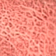
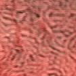
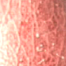
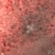

# Web-app-Gastroscopic-Classifier
A patch-based Gastroscopic Classifier web app with Python backend using Flask micro-framework and PyTorch modified Resnet-34 Convolutional Neural Network.

# Application
* Assist Medical Doctors to classify gastric lesion types based on small selected patch on an endoscopy image.
* 6 Lesion types: Active Gastritis, Atrophic Gastritis, Chronic Gastritis, Intestinal Metaplasia, Normal, Ulcer.
  <h2>Sample Gastroscopic Images:</h2>  
 
 

# UI (User Interface)

# Dataset
* 6-class gastroscopic dataset provided by CNRS (French National Centre for Scientific Research) and 108 Military Central Hospital.
* Lesion classes: Active Gastritis, Atrophic Gastritis, Chronic Gastritis, Intestinal Metaplasia, Normal, Ulcer.

# Deep Learning
* CNN model: Modified ResNet-34 model with pretrained backbones.
* Multi-perception Layer: 512-256-6.
* Regularization technique: Dropout with **p=0.2**.
 
<h2>Sample Patch</h2>
   

# Technology used
* Backend Language: Python 3.8
* (Core Algorithm) Deep Learning framework: PyTorch
* (Core Algorithm) Image Processing library: OpenCV
* Backend Micro-framework: Flask
* Front-end: pure HTML, CSS, Javascript (no framework).
